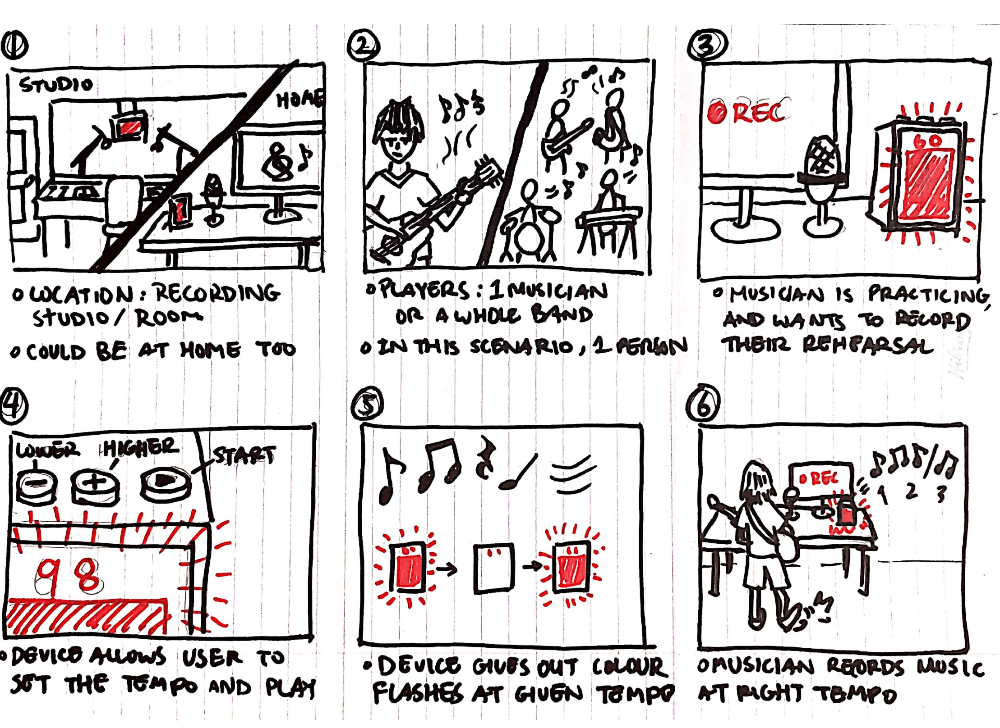

# Staging Interaction

In the original stage production of Peter Pan, Tinker Bell was represented by a darting light created by a small handheld mirror off-stage, reflecting a little circle of light from a powerful lamp. Tinkerbell communicates her presence through this light to the other characters. See more info [here](https://en.wikipedia.org/wiki/Tinker_Bell). 

There is no actor that plays Tinkerbell--her existence in the play comes from the interactions that the other characters have with her.

For lab this week, we draw on this and other inspirations from theatre to stage interactions with a device where the main mode of display/output for the interactive device you are designing is lighting. You will plot the interaction with a storyboard, and use your computer and a smartphone to experiment with what the interactions will look and feel like. 

_Make sure you read all the instructions and understand the whole of the laboratory activity before starting!_

## Prep

### To start the semester, you will need:
1. Set up your own Github "Lab Hub" repository to keep all you work in record by [following these instructions](https://github.com/FAR-Lab/Developing-and-Designing-Interactive-Devices/blob/2021Fall/readings/Submitting%20Labs.md).
2. Set up the README.md for your Hub repository (for instance, so that it has your name and points to your own Lab 1) and [learn how to](https://guides.github.com/features/mastering-markdown/) organize and post links to your submissions on your README.md so we can find them easily.
3. (extra: Learn about what exactly Git is from [here](https://git-scm.com/book/en/v2/Getting-Started-What-is-Git%3F).)

### For this lab, you will need:
1. Paper
2. Markers/ Pens
3. Scissors
4. Smart Phone -- The main required feature is that the phone needs to have a browser and display a webpage.
5. Computer -- We will use your computer to host a webpage which also features controls.
6. Found objects and materials -- You will have to costume your phone so that it looks like some other devices. These materials can include doll clothes, a paper lantern, a bottle, human clothes, a pillow case, etc. Be creative!

### Deliverables for this lab are: 
1. Storyboard
1. Sketches/photos of costumed device
1. Any reflections you have on the process
1. Video sketch of the prototyped interaction
1. Submit the items above in the lab1 folder of your class [Github page], either as links or uploaded files. Each group member should post their own copy of the work to their own Lab Hub, even if some of the work is the same from each person in the group.

### The Report
This README.md page in your own repository should be edited to include the work you have done (the deliverables mentioned above). Following the format below, you can delete everything but the headers and the sections between the **stars**. Write the answers to the questions under the starred sentences. Include any material that explains what you did in this lab hub folder, and link it in your README.md for the lab.

## Lab Overview

A) [Plan](#part-a-plan) 

B) [Act out the interaction](#part-b-act-out-the-interaction) 

C) [Prototype the device](#part-c-prototype-the-device)

D) [Wizard the device](#part-d-wizard-the-device) 

E) [Costume the device](#part-e-costume-the-device)

F) [Record the interaction](#part-f-record)

## Part A. Plan 

The interactive device can be anything *except* a computer, a tablet computer or a smart phone, but the main way it interacts needs to be using light.

\*\***Describe your setting, players, activity and goals here.**\*\*

*Setting*: In a quiet room, or a recording studio.

*Players*: One musician, or a music band, could be four to five people, or a large group of musicians.

*Activity*: The musicians are rehearsing, but importantly they are recording their rehearsal.

*Goals*: Each individual is trying play the music and keep the beat, making sure to not rush or lag behind others.

Sketch a storyboard of the interactions you are planning. It does not need to be perfect, but must get across the behavior of the interactive device and the other characters in the scene. 

\*\***Include a picture of your storyboard here**\*\*

Present your idea to the other people in your breakout room. You can just get feedback from one another or you can work together on the other parts of the lab.

\*\***Summarize feedback you got here.**\*\*

Some responses I've gathered in the breakout group about this idea:
- This is a nice idea because light can stand out distinctly for keeping the beat in a loud situation, especially when you have different instrument sounds playing at the same time.
- Isn't there usually a band director who does this job?
- This may be even more useful for a solo artist who is recording by themselves, who do not want a noisy metronome but also do not have a director to keep the beat for them.
- This is like a "light metronome"
- Usually in a small band, the drum playing is the one who keeps the beat by default

## Part B. Act out the Interaction

Try physically acting out the interaction you planned. For now, you can just pretend the device is doing the things you’ve scripted for it. 

\*\***Are there things that seemed better on paper than acted out?**\*\*
- I designed the Light Metronome to have physical buttons on it to control the tempo of the metronome flashes, this may not be ideal when the musician is sitting from some distance away, and cannot reach the metronome easily. Perhaps there should be a remote control included with the device.
- During the interaction we placed the Light Metronome on a table. It occured to me that I did not consider there might be objects blocking the metronome if there are multiple people using it. So the Metronome has to either be hung in a highly visible place, or there must be mutliple devices working in sync so that everyone can see the tempo.

\*\***Are there new ideas that occur to you or your collaborators that come up from the acting?**\*\*
- In a future version, we might need to include a remote control for the device for ease of control.
- We might also make the Metronome a copy of 4 or 5 linked display boards instead of just one device, so that it can be seen by everyone in a large band environment.

## Part C. Prototype the device

You will be using your smartphone as a stand-in for the device you are prototyping. You will use the browser of your smart phone to act as a “light” and use a remote control interface to remotely change the light on that device. 

Code for the "Tinkerbelle" tool, and instructions for setting up the server and your phone are [here](https://github.com/FAR-Lab/tinkerbelle).

We invented this tool for this lab! 

If you run into technical issues with this tool, you can also use a light switch, dimmer, etc. that you can can manually or remotely control.

\*\***Give us feedback on Tinkerbelle.**\*\*
- Despite trying to get the app to work for a while, none of us in the breakout group were able to do it. During my own prototyping phase I chose to just use a digital colour background on my phone to mimic the Tinkerbelle page.

## Part D. Wizard the device
Take a little time to set up the wizarding set-up that allows for someone to remotely control the device while someone acts with it. Hint: You can use Zoom to record videos, and you can pin someone’s video feed if that is the scene which you want to record. 

\*\***Include your first attempts at recording the set-up video here.**\*\*

Now, hange the goal within the same setting, and update the interaction with the paper prototype. 

\*\***Show the follow-up work here.**\*\*
- We changed the filming technique and added a few more cuts to highlight the interactions with the Light Metronome device.

## Part E. Costume the device

Only now should you start worrying about what the device should look like. Develop a costume so that you can use your phone as this device.

Think about the setting of the device: is the environment a place where the device could overheat? Is water a danger? Does it need to have bright colors in an emergency setting?

\*\***Include sketches of what your device might look like here.**\*\*

\*\***What concerns or opportunitities are influencing the way you've designed the device to look?**\*\*
- I wanted the physical buttons on the device to be at the top and large so that they are easily located. 
- I didn't want to add more that the 3 buttons (2 for controlling the tempo and 1 for start/stopping the flash) because this would keep the device easy to operate and its function clear.

## Part F. Record

\*\***Take a video of your prototyped interaction.**\*\*

https://user-images.githubusercontent.com/14202464/132264887-6e1aa1de-026f-49b2-9c48-fc14a7caf064.mp4

\*\***Please indicate anyone you collaborated with on this Lab.**\*\*
Be generous in acknowledging their contributions! And also recognizing any other influences (e.g. from YouTube, Github, Twitter) that informed your design. 
- Thanks to Hong Xuan for lending me his guitar and helping me film the device interaction.

# Staging Interaction, Part 2 

This describes the second week's work for this lab activity.

## Prep (to be done before Lab on Wednesday)

You will be assigned three partners from another group. Go to their github pages, view their videos, and provide them with reactions, suggestions & feedback: explain to them what you saw happening in their video. Guess the scene and the goals of the character. Ask them about anything that wasn’t clear. 

\*\***Summarize feedback from your partners here.**\*\*

## Make it your own

Do last week’s assignment again, but this time: 
1) It doesn’t have to (just) use light, 
2) You can use any modality (e.g., vibration, sound) to prototype the behaviors! Again, be creative!
3) We will be grading with an emphasis on creativity. 

\*\***Document everything here. (Particularly, we would like to see the storyboard and video, although photos of the prototype are also great.)**\*\*
